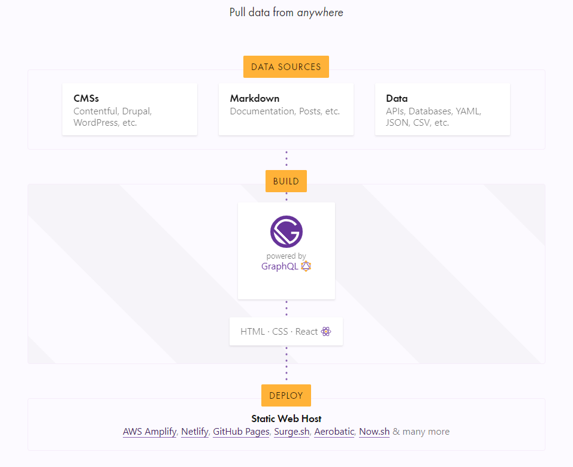
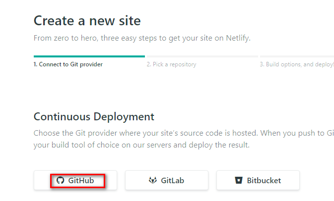

###

## 前言

###

做开发也算有不短的年头了，一直想做个自己的小站，从Android开发到web开发，无奈种种原因一直没有做成，现在终于做成了 舒坦 哈哈哈... happy😊  

- **需要了解的知识:** 

<p>
  <a href="https://reactjs.org/">
    
  </a>
  <a href="https://www.gatsbyjs.org">
    
  </a>
  <a href="http://graphql.cn/">
    
  </a>
</p>

## Gatsby介绍

Gatsby是一个构建静态渐进式Web应用的一大利器，是基于React的构建超快速的网站和应用程序的免费开源框架。它是一个静态PWA（Progressive Web App）生成器。它会生成网站的HTML页面，但也会创建一个JavaScript运行时，一旦加载了初始HTML，它就会在浏览器中接管。这使得其他页面可以即时加载；Gatsby只加载关键的HTML，CSS，数据和JavaScript，以便网站尽快加载。

- **构建 静态 渐进式Web应用程序:** 获得开箱即用的代码和数据；只加载关键的HTML，CSS，数据和JavaScript；加载后，会为其他页面预取资源。
- **自带数据:** 丰富的数据插件生态系统,使用GraphQL将无头CMS，SaaS服务，API，数据库，文件系统等数据直接导入页面；站点所需数据来自一个或多个来源。
- **轻松部署:** 对于小型应用无需数据库和服务器部署及其昂贵，耗时的设置成本；可以在几十种服务上轻松部署。

### Gatsby运作模式



以上Gatsby简单介绍完毕，让我们开始构建自己的无后端应用吧，该干活了兄dei😆.. 正所谓工欲善其事必先利其器，so...


### 工具

<p>
  <a href="https://code.visualstudio.com/">
    
  </a>
  <a href="https://git-scm.com/downloads">
    
  </a>
  <a href="https://github.com/">
    
  </a>(
  <a href="https://prettier.io/">
    
  </a>/
  <a href="https://cn.eslint.org/">
    
  </a>)
</p>

#### 安装Gatsby CLI.

```json
npm install -g gatsby-cli
```

#### 创建新站点.

```json
gatsby new gatsby-site
cd gatsby-site
```

#### 启动开发服务器.

```json
gatsby develop
```
默认情况下可访问localhost:8000，支持hot-reloading；端口被占用会启动8001端口，以此类推。稍后我们将要使用git把source上传github。

### 项目目录

```json
/
|-- /.cache
|-- /plugins
|-- /public
|-- /src
    |-- /components
    |-- /pages
    |-- /templates
    |-- html.js
|-- /static
|-- gatsby-config.js
|-- gatsby-node.js
|-- gatsby-ssr.js
|-- gatsby-browser.js
```

#### 关键目录说明

- **.cache:** 自动生成。此文件夹是Gatsby自动创建的内部缓存。webpack所需的所有文件都在.cache目录中，此目录中的文件不用修改。.gitignore如果尚未添加，应添加到文件中
- **public:** 自动生成。构建过程的输出将在此文件夹中公开。.gitignore如果尚未添加，应添加到文件中
- **plugins:** 本地插件
- **src:** 源代码
>- **components:** 页面组件
>- **pages:** src / pages下的组件会根据文件名自动变为页面
>- **templates:** 页面模板，以编程方式创建页面
>- **html.js:** 对于默认.cache / default_html.js的自定义配置
- **static:** 存放logo图片等静态文件,会被复制到未更改的公用文件夹中
- **gatsby-browser.js:** Gatsby浏览器API，可自定义/扩展影响浏览器的默认Gatsby设置
- **gatsby-config.js:** Gatsby站点的主要配置文件。指定站点（元数据）、Gatsby插件的配置信息
- **gatsby-node.js:** Gatsby节点API，可自定义/扩展默认Gatsby设置，影响网站构建过程的各个部分
- **gatsby-ssr.js:** Gatsby服务器端渲染API，可自定义影响服务器端呈现的默认Gatsby设置

## GitHub Source管理

source关联GitHub方式有很多，自行选择，这里使用GitHub+SSH的方式：
/source 目录下
#### 初始化
```json
$ git init
```
#### 检查本地是否已经存在密钥
```json
$ cd ~/.ssh
$ ls
```
#### 创建一个 SSH key 
```json
$ ssh-keygen -t rsa -C "your_email@example.com"
```
代码参数含义：

-t 指定密钥类型，默认是 rsa ，可以省略。
-C 设置注释文字，比如邮箱。
-f 指定密钥文件存储文件名。
默认生成 id_rsa 和 id_rsa.pub 两个秘钥文件。

接着会提示你输入两次密码：该密码是你push文件的时候要输入的密码，而不是github管理者的密码
```json
Enter passphrase (empty for no passphrase): 
# Enter same passphrase again:
```

当你看到下面这段代码，就说明，SSH key 已经创建成功
```json
Your identification has been saved in /c/Users/you/.ssh/id_rsa.
# Your public key has been saved in /c/Users/you/.ssh/id_rsa.pub.
# The key fingerprint is:
# 01:0f:f4:3b:ca:85:d6:17:a1:7d:f0:68:9d:f0:a2:db your_email@example.com
```
#### 添加 SSH key 到 github上面去
git命令复制该文件的内容
```json
$ clip < ~/.ssh/id_rsa.pub
```
然后登录GitHub账户 → `Settings` → `SSH and GPG keys` → `New SSH key`。

#### 测试一下连接

```json
$ ssh -T git@github.com
```

会有一段警告代码：

```json
The authenticity of host 'github.com (207.97.227.239)' can't be established.
# RSA key fingerprint is 16:27:ac:a5:76:28:2d:36:63:1b:56:4d:eb:df:a6:48.
# Are you sure you want to continue connecting (yes/no)?
```

输入 yes 回车既可。如果创建 SSH key 的时候设置了密码，就会提示你输入密码：
```json
Enter passphrase for key '/c/Users/Administrator/.ssh/id_rsa':
```

输入密码即可，如果出现下面提示：
```json
Hi username! You've successfully authenticated, but GitHub does not
# provide shell access.
```
说明已经成功设置SSH密钥。

#### 本地仓库关联到github上
```json
$ git remote add origin <远程仓库链接>
$ git status
```

将source添加到仓库
```json
$ git add --all 
$ git status
```

代码合并
```json
$ git pull --rebase origin master
```

上传代码
```json
$ git push -u origin master
```
至此，项目构建和source管理的问题得以解决,待项目功能完善之后我们可以选择发布、托管平台，我使用的`Netlify`，下面会介绍`Netlify`。（这里选择把`Netlify`放在这里介绍因为项目从构建→source管理→发布一整条线下来会比较清晰，放到最后面介绍会觉得拖拉；放在这里介绍的话，在后面的文章中只需要关注需要实现功能业务等就行.）

## Netlify 托管
Netlify是一个统一平台，可自动执行代码，以创建高性能，易于维护的站点和Web应用程序。提供持续部署，智能的全局CDN，完整的DNS（包括自定义域），自动HTTPS，资产加速等等。Netlify的免费套餐包括无限的个人和商业项目，HTTPS，公共或私有repos的持续部署等。

### 托管设置

- **上传站点文件夹:**
>将Gatsby项目下/public文件夹下生成的站点文件(包含CSS，JavaScript，图像和HTML文件)直接上传到`Netlify`.

- **Git存储库设置:**
>`Netlify`支持GitHub，GitLab和Bitbucket。托管部署时选择相应的存储库，我们要做只需将代码推送到相应的存储库；每次source变更时`Netlify`就会自动构建、发布。

这里使用的是第二种方式部署：

>首先你需要有一个[Netlify](https://www.netlify.com/)账号；

>登录之后选择`New site from Git`之后：


>然后选择repository

>然后配置build/deploy选项：

关于高级选项中`New variable`定义环境变量，可以自行选择，Gatsby本身也支持`Project Env Vars`和`OS Env Vars`以及不同环境中的自定义行为；所以我没有使用netlify.toml配置文件(详细请查看[Gatsby Environment](https://www.gatsbyjs.org/docs/environment-variables/))。

最后选择`Deploy site`。

### 域名设置

选择我们托管的站点：Overview → Domain Settings 

默认情况下，站点始终可以通过基于站点名称的Netlify子域访问。自定义域允许您通过一个或多个非netlify域名访问站点。


发布之后我们就可以持续的往站点中添加功能，而无需再关注部署发布等问题啦，是不是很方便。
项目每次更新Netlify会自动监听Github repository的变化，所以不用担心重新发布的问题，但是Netlify的rebuild → redeploy过程大概会持续十几到二十分钟左右吧，可能跟我网速有关😒.. 后面事我们就只要关注业务功能实现就行了，不过用着还是挺爽的哈哈...😄


