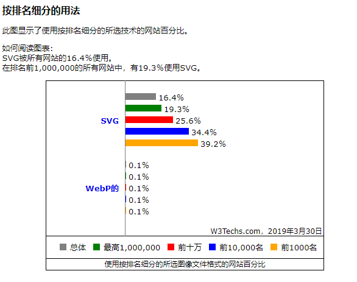

###

&nbsp;&nbsp;&nbsp;&nbsp;个人网站基础功能虽然有了，但不免还是有很多问题要处理，比如图片、DOM、数据结构、代码、SEO、安全等优化，功能仍待完善，仔细一想有一堆问题等待处理....一步一步来，使用Google speed测评跑分Desktop下只有70多分，移动版就更不用说了...于是花了一两天时间调查现代浏览器图片图像处理相关的知识涵盖物理优化和代码优化处理，所以就有了本篇文章，以此作为记录。

### 问题

偶然的一次用手机访问的时候发现加载远程图片的时候，尤其是请求某些国外io站点资源的时候（因为我在博客中用了国外io站点生成的SVG图片，URL指向io站点的，当时也没太在意），结果在请求不到图片资源时页面会被阻塞，慢速网时直到资源请求超时失败或成功，页面才会被渲染出来，所以决定干脆把所有用到图片全部本地化、优化处理。（CSS Sprites(雪碧图)、字体图标以及CDN不在本文讨论范围内）下面介绍两种我用到的图片类型：

### SVG 
&nbsp;&nbsp;&nbsp;&nbsp;SVG（Scalable Vector Graphics可缩放矢量图形）是一种基于XML的矢量图形文件格式，是一种无损文件格式，是html5的图形标准，历史悠久；SVG可用于静态图形和动画。SVG被广泛用于代替 JPEG，GIF和PNG图像，用于图标，徽标，漫画和其他图形。

- **可伸缩性：** SVG（理论上）可以无限扩展。您可以根据需要将它们设置为大或小，而不会影响质量。
- **文件大小：** SVG平均比GIF，JPEG，PNG小得多，即使在极高分辨率下也是如此。
- **动画：** 就像GIF格式，支持SVG动画，但有很多更多的灵活性和无比更高的质量。
- **Codable：** 可以使用HTML，CSS和JavaScript直接操作SVG。
- **Graphics only:** SVG是矢量图形格式。

注意文中描述的是图形，它与PNG，JPEG和jpg格式的图片(这里指摄影照片一类)不同，摄影类图片由于包含的色彩和图形信息过于复杂不适用于SVG（svg文件会很大，实践出真知），遵循标准就好。

### webp 
WebP是Google最初于2007年发布的一种现代图像格式。与任何其他流行格式相比，WebP能够提供卓越的无损和有损图像压缩。

- **压缩：** WebP可以通过无损和有损压缩进行压缩。
- **文件大小：** WebP可以将JPEG文件减少高达34％，将PNG图像减少高达45％。WebP可用于图形和摄影。
- **浏览器支持：** 只有Chrome和Opera完全支持WebP。

具w3techs网站调查显示：




使用webp格式压缩前后对比：


### 图片优化

&nbsp;&nbsp;&nbsp;&nbsp;通常我们进行图片优化大多是通过修改图片大小品质，png、jpg、jpeg、webp、webm、svg格式转换，gzip压缩等方式对图片进行物理优化，然后再通过图片占位符、延迟加载技术对图片等静态资源进行软优化；这些呢需要我们一步一步的去操作，但是在Gatsby中我们就无需这么多步骤啦，直接一步到位。  
具体实施最简单方式就是先通过工具软件把图片转换成你想用的格式；我的个人网站就是把文章内的图片都转换成webp格式的，虽然兼容性还不是太好，但是图片占用的空间累计下来减少的可不是一星半点。

#### 延迟加载 / 懒加载

- **IntersectionObserver(交叉观察器) / Scroll方式：** 直接给出实例,存在兼容问题请使用<a href="https://github.com/w3c/IntersectionObserver/tree/master/polyfill">polyfill</a>。详情参考：<a href="http://www.ruanyifeng.com/blog/2016/11/intersectionobserver_api.html">IntersectionObserver API 使用教程</a>


```javascript
export const lazyLoad = () => {  
  let lazyImages = Array.from(document.getElementsByClassName('lazy'));
  if ("IntersectionObserver" in window) {
    const observer = new IntersectionObserver(
        (items) => {
          items.forEach((item) => {
              if(item.intersectionRatio > 0){
                  var img = item.target;
                  img.src = img.dataset.src;
                  observer.unobserve(img);
              }
          })
        }
    )
    lazyImages.forEach((item) => {
        observer.observe(item);
    })
  } else {
    let active = false;
    const scrollLoad = function() {
      if (active === false) {
        active = true;
        setTimeout(function() {
          lazyImages.forEach(function(lazyImage) {
            if ((lazyImage.getBoundingClientRect().top <= window.innerHeight 
                && lazyImage.getBoundingClientRect().bottom >= 0) 
                && getComputedStyle(lazyImage).display !== "none") {
              lazyImage.src = lazyImage.dataset.src;
              lazyImage.srcset = lazyImage.dataset.srcset;
              lazyImage.classList.remove("lazy");
              lazyImages = lazyImages.filter(function(image) {
                return image !== lazyImage;
              });
              if (lazyImages.length === 0) {
                document.removeEventListener("scroll", scrollLoad);
                window.removeEventListener("resize", scrollLoad);
                window.removeEventListener("orientationchange", scrollLoad);
              }
            }
          });
          active = false;
        }, 200);
      }
    }
    document.addEventListener("scroll", scrollLoad);
    window.addEventListener("resize", scrollLoad);
    window.addEventListener("orientationchange", scrollLoad);
  }
}
```

#### Gatsby图片优化、流体容器的图像

要用到plugin：`gatsby-image`、`gatsby-plugin-sharp`；  
默认情况下，在加载JavaScript之前不会加载图像。  
`gatsby-image`是一个专门设计的React组件，可与Gatsby的GraphQL查询无缝协作，针对固定宽度/高度的图像和图像进行了优化，可以拉伸容器的整个宽度。  
`gatsby-image`使用 `gatsby-plugin-sharp` 提供图像转换，支持`<picture>`标签。这个较新的标准允许浏览器选择媒体类型而不使用JavaScript。它也向后兼容旧版浏览器（IE 11等）.我的个人站是基于Gatsby的用的这种方式省心省力。  
延迟加载行为取决于**IntersectionObserver**在一些相当常见的浏览器（包括Safari和IE）中不可用的行为,所以需要**polyfill**。  
**GraphQL**查询使用优化的JPEG和PNG压缩创建多个缩略图。`gatsby-image`组件自动设置“模糊”效果以及在屏幕下方延迟加载图像。

##### 流体容器（Fluid Container）

&nbsp;&nbsp;&nbsp;&nbsp;简单点说就是基于视口百分比的布局方式，但是仍然需要QueryMedia来对移动端布局进行调整，这种模式可以同时兼容PC端、移动端，所以页面布局渲染时是不关注使用者是移动端还是pc端，而这种方式无疑使的处理图片时变得复杂，好在Gatsby提供了原生插件支持，本文末尾提供流体布局参考。

##### gatsby-image支持两种类型的响应图像


- **具有固定宽度和高度的图像：** 根据不同的屏幕分辨率改变图像的大小。

```GraphQL
const query={graphql`
...
  imageSharp {
    fixed(width: 400) {
      ...GatsbyImageSharpFixed
      // or ...GatsbyImageSharpFixed_withWebp_tracedSVG
    }
  }
...`
```
>可用的**fixed**内置GraphQL查询片段：
>- **GatsbyImageSharpFixed** 
>- **GatsbyImageSharpFixed_noBase64** 
>- **GatsbyImageSharpFixed_tracedSVG** 
>- **GatsbyImageSharpFixed_withWebp** 
>- **GatsbyImageSharpFixed_withWebp_noBase64** 
>- **GatsbyImageSharpFixed_withWebp_tracedSVG** 


- **横跨流体容器的图像：** 为宽度从智能手机扩展到宽屏桌面显示器的设备创建多种尺寸的缩略图。

```GraphQL
const query={graphql`
...
  imageSharp {
    fluid(maxWidth: 700) {
      ...GatsbyImageSharpFluid_noBase64
    }
  }
...`
```
>可用的**fluid**内置GraphQL查询片段：
> - **GatsbyImageSharpFluid** 

> - **GatsbyImageSharpFluid_noBase64** 

> - **GatsbyImageSharpFluid_tracedSVG** 

> - **GatsbyImageSharpFluid_withWebp** 

> - **GatsbyImageSharpFluid_withWebp_noBase64** 

> - **GatsbyImageSharpFluid_withWebp_tracedSVG** 


##### 使用流体类型避免拉伸图像
在图像宽度小于可用视口的情况下，图像将拉伸以匹配容器，可能导致不必要的问题和图像质量下降。对于这种情况，**maxWidth**：

```jsx
const NonStretchedImage = props => {
  let normalizedProps = props
  if (props.fluid && props.fluid.presentationWidth) {
    normalizedProps = {
      ...props,
      style: {
        ...(props.style || {}),
        maxWidth: props.fluid.presentationWidth,
        margin: "0 auto", // Used to center the image
      },
    }
  }

  return 
}
```
presentationWidth需要在graphql查询中添加它，

```GraphQL
const query={graphql`
...
  childImageSharp {
    fluid(maxWidth: 500, quality: 100) {
      ...GatsbyImageSharpFluid
      // or ...GatsbyImageSharpFluid_withWebp_tracedSVG
      presentationWidth
    }
  }
...`
```
gatsby-image还有很多其它可选属性设置比较常用的如：
- **onLoad：**加载完整尺寸图像时调用的回调。
- **onStartLoad：**在全尺寸图像开始加载时调用的回调，提供参数{wasCached：boolean}。
- **fadeIn：**图像淡入。
- **placeholderStyle：**占位符式样。
- **onError：**无法加载时的回调。
- **critical：**退出延迟加载行为。默认为false。

以上是这两天处理网站图片问题时候的全部解决方式，以此作为总结，speed测试跑分Desktop下80+，mobile下依旧不到60，但是有明显提升；下一步解决DOM、数据代码的问题，Gatsby建站教程要往后放一放了,继续解决问题去。

参考：  
<a href="https://www.w3schools.com/w3css/w3css_grid.asp">W3.CSS Responsive Fluid Grid</a>  
<a href="https://www.creativebloq.com/css3/create-fluid-layouts-html5-and-css3-3142768">Create fluid layouts with HTML5 and CSS3</a>  
<a href="https://www.script-tutorials.com/fluid-layouts-for-your-website/">Fluid layouts for your website</a>  
<a href="http://caibaojian.com/fluid-typography.html">移动端使用VH和VW实现真正的流体排版</a>  
