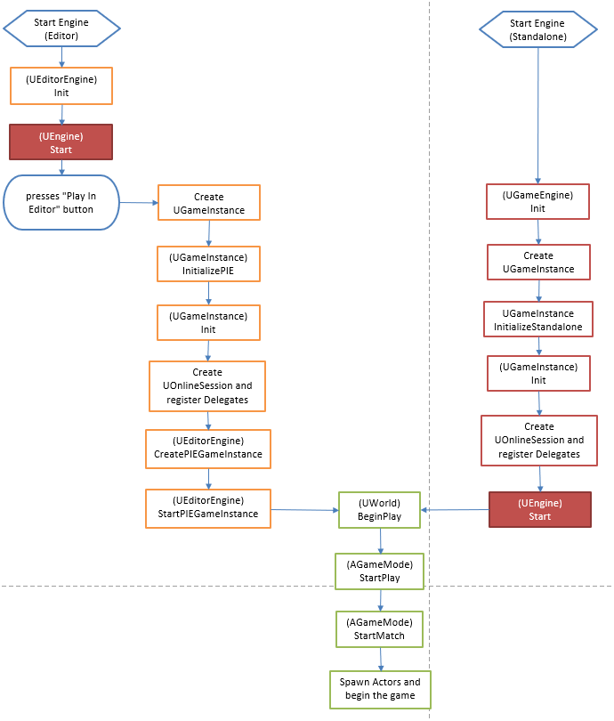

    
### 前言

### 知识模块整理大纲

&nbsp;&nbsp;&nbsp;&nbsp;通过一段时间的探索和学习，也只是掌握了引擎中一部分的核心知识点（不得不说引擎中的东西太多了😓，涵盖的内容太全面了👍），大纲只是列出本人深度学习过的知识点，并不全面，仅作参考和复习之用。

- **Engine 模块（Gameplay）：** 常用的基础游戏元素，基本核心元素，包含最基本的游戏类，如：Pawn、Actor、Character、Controller、Camera...等。

- **NetWork：** UE4的网路连接C/S模式,主要涉及NetDriver/NetConnection、Session、Replication、ActorRole、RPCs等知识。

- **Slate Framework：** 引擎的跨平台UI框架，主要涉及Widgets/自定义组件、UMG(可视化组件)等知识。最好的学习途径UE4-Editor 源码。

- **UE4 Moudle与Plugin：** 模块化与插件开发。

- **Level System：** 关卡系统,主要涉及场景地编、Actors、关卡切换和Level stream。

- **Asset System：** 资源系统，主要涉及资源的加载和引用,现有FBX模型、动画资源导入导出。

- **Animation System：** 骨骼模型动画系统，主要涉及StateMachine、Montage、Montage Notify、BlendSpace，AnimReTarget。

- **Physics System：** 物理模拟系统，主要涉及Collision、Physics Materials、Constraint(约束)、Physics Bodies等知识。

- **AI System：** AI系统主要涉及Blackboard和Behavior Tree行为树知识点。

- **Audio System：** 音频系统，主要使用Sound Cue API和Buleprint音频混合。

以上只是UE4引擎中的部分内容，还有UE4中定义的大量的宏和修饰符(反射机制)、热重载(动态加载)、UBT/UHT编译工具的使用、图形渲染(Shader)、Sequencer/Matinee、Texture(纹理)/Material(材质)、Particle(粒子)系统/ParticleLOD(粒子级联)、Lighting等等都是完全可以作为独立模块去学习的。纹理材质、粒子、光线都还好说，动态加载和UBT/UHT则是对UE4 Source模块编译解析的理解，还是需要有耐心的去深度挖掘UE4引擎中较底层的编译解析知识的，为理解UE4中的反射机制铺路；图形渲染Shader的编写涉及渲染管线图形原理等知识的，像本人图形渲染这方面的知识怎么滴也得回炉一遍，所以和渲染shader相关的知识只能放在最后去总结了。

### Engine-Gameplay 模块

Engine-Gameplay模块：包含与游戏关联的功能。Game World-世界、Actors-演员、Controllers-控制器、Characters-角色、 physics-物理和effects-特效都在引擎模块中定义。   
比如一些比较常见的：   
- **Actors-演员：** AActor、AHUD、AVolume、AGameMode等。

- **Pawn-角色：** APawn、ACharacter.

- **Controllers-控制器：** AController、AAIController、APlayerController.

- **Components-组件：** UActorComponent、USkeletalMeshComponent、UParticleSystemComponent.

- **Gameplay-游戏玩法：** UPlayer、ULocalPlayer、UWorld、ULevel.

- **Assets-资源：** UTexture、UMaterial、UStaticMesh、USkeletalMesh、UParticleSystem.

以上内容是引擎中比较基础、也最常用到的元素，通过这些元素我们就可以构建出一个基础的虚拟世界，作为开发者当然还是需要从程序设计的角度理解UE4引擎的基础框架。游戏启动的流程图(来自官方)：<a href="https://www.w3schools.com/w3css/w3css_grid.asp">Unreal Engine API Reference</a>  

图中给我们展示了启动游戏的两种方式：从编辑器启动(PIE)模式和作为独立应用启动(Standalone)模式。   
- **PIE 模式启动：** 基于编辑器环境，通过UEditorEngine(自UEngine继承)初始化引擎启动。游戏世界实例(UGameInstance)通过调用` InitializePIE` 方法初始化、启动基于编辑器环境的游戏世界实例。   
- **Standalone 模式启动：** 作为独立应用程序，通过UGameEngine(自UEngine继承)初始化引擎启动。游戏世界实例(UGameInstance)通过调用` InitializeStandalone` 方法初始化、启动基于应用Config配置文件的游戏世界实例。   

如果有首屏动画/MV的配置，以上两种方式下的加载似乎也不同，PIE 模式下似乎会直接跳过首屏动画/MV直接进入游戏内容，独立模式下不会（当时也没仔细留意这个问题，有待校正）。   

在Engine模块中经常打交道的一些类：UEngine、UWorld、FWorldContext、ULevel、UGameInstance、AActor、UPlayer、AController、AHUD、AGameMode、APlayerController、UActorComponent等等，不一 一列举，后续的文章中会有相应的介绍。不过还是要多看官方文档视频(请自备梯子😀)去学习。另外也看看<a href="https://www.cnblogs.com/fjz13/p/5938465.html">《Inside UE4》</a> 系列对UE4 Gameplay架构的分析文章加深理解。大纲性的介绍就先这么多吧，后面再对各个模块中用过的知识点进行整理。

